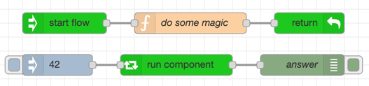
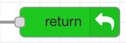

# node-red-contrib-components

Reusable Node-RED flows with an explicit input API.

This package adds three nodes that let you define a reusable flow once and call it from anywhere else in your workspace. Compared with plain subflows, the focus here is on a visible parameter contract, predictable return routing, and support for nested component calls.



## What this package does

Use components when you want to treat a flow like a callable unit with a defined interface:

- define a reusable flow with expected input parameters
- call that flow from another tab or branch with explicit parameter mapping
- return control to the caller through one or more return nodes
- keep nested component calls working without losing routing context

This is most useful when a project has many tabs or repeated orchestration logic and simple copy/paste or plain subflows are no longer enough.

## When to use it instead of subflows

Use this package when you need one or more of these properties:

- the called flow should expose a visible list of expected message inputs
- the caller should map values from msg, flow/global context, constants, environment variables, JSONata, or other node properties
- the called flow should be able to return through named return points
- nested component calls should preserve caller context

If you only need a simple reusable block with minimal configuration, standard Node-RED subflows may still be the simpler choice.

## Compatibility

The currently validated support contract is:

- Node.js 18, 20, and 22
- Node-RED 4.x

The repository CI validates:

- runtime tests across the Node.js support matrix
- coverage and package-content checks
- browser-level editor workflows with headless Playwright

## Installation

Install the package from the Node-RED palette manager or with npm:

```bash
npm install node-red-contrib-components
```

After restarting Node-RED, the package contributes these palette nodes:

- `comp start`
- `comp return`
- `use comp`

## Node overview

### comp start


`comp start` defines the entry point of a reusable component flow.

Use it to declare the component API:

- parameter name
- parameter type
- required or optional

That API is then picked up by `use comp`, which renders the parameter mapping UI for callers.

### comp return



`comp return` hands the message back to the caller.

Key behavior:

- nested component calls are supported
- one component flow can contain multiple return nodes
- each return node can either feed the shared default output or expose its own labeled output on the caller
- if a return node receives a message outside a component call context, it can broadcast to matching callers for that flow

### use comp


`use comp` calls a component defined elsewhere in the workspace.

For each declared parameter, the node can source values from the same kinds of inputs users know from the Change node and typed input controls, including:

- `msg`, flow context, and global context
- strings, numbers, booleans, JSON, timestamps, and other typed constants
- JSONata expressions
- environment variables
- node properties

Before dispatch, the node validates configured parameter values against the declared API and surfaces validation errors when required inputs are missing or types do not match.

## First workflow

The quickest way to understand the package is the shipped basic example.

### Option 1: import the example

1. Open the Node-RED editor.
2. Use Import.
3. Select the examples for `node-red-contrib-components`.
4. Import the `basic.json` example.
5. Deploy and trigger the inject node.

The basic example shows the smallest possible component round-trip:

- an inject node calls `use comp`
- `use comp` targets a component defined by `comp start`
- the component returns through `comp return`
- the result appears in a debug node

### Option 2: build the same flow manually

1. Add a `comp start` node and give the component a name.
2. Wire it to a `comp return` node.
3. Add a `use comp` node somewhere else in the flow.
4. Select the component in the `use comp` editor.
5. If the component defines parameters, map each required input.
6. Wire the caller output to a debug node.
7. Trigger the caller with an inject node.

For more advanced setups, see the example flows listed below.

## What is validated

The runtime and editor behavior now align on these expectations:

- required parameters must be configured
- configured values are type-checked against the component API
- stale or missing target components are surfaced in the editor
- output label mismatches caused by changed return-node modes are surfaced in the editor

## Known limitations

The package is usable, but there are still practical limits users should know about.

### Copy and paste behavior

`use comp` can be copied on its own, but copying or cutting a whole component definition together with linked callers does not reliably preserve the association between the nodes.

If you need to move a component definition and its callers together, the safest workaround is:

1. export the relevant nodes
2. remove them from the original tab
3. import them into the destination tab

### Scope of the browser tests

The editor test suite covers a few high-value workflows, not every possible configuration path. Runtime behavior is covered primarily through Node-RED helper tests.

### Roadmap items are not product guarantees

There are still feature ideas around richer parameter validation, output shaping, and additional parameter types. Treat those as future work, not as supported behavior in the current release.

## Included examples

The repository ships several example flows under `examples/`:

- `basic.json`: minimal component round-trip
- `embedded.json`: nested component calls and multiple returns
- `broadcast.json`: return-node broadcast behavior
- `in-only.json`: input-only component scenarios
- `recursion.json`: recursive component wiring patterns

## Development and verification

Repository commands:

```bash
npm test
npm run test:coverage
npm run pack:check
npm run uitest
npm run release:check
```

What they cover:

- `npm test`: runtime regression suite
- `npm run test:coverage`: runtime coverage with branch threshold enforcement
- `npm run pack:check`: validates the published package contents
- `npm run uitest`: headless browser checks for key editor workflows
- `npm run release:check`: full release gate used for the current review hardening work

## Additional technical notes

For maintainers who need the runtime protocol details, see [components/COMP_PROTOCOL.md](components/COMP_PROTOCOL.md).

## Project status

The current focus is on a stable runtime, explicit compatibility targets, safer publishing, and a small but meaningful editor E2E suite. Feature ideas beyond that are better tracked as issues than kept inline in the package landing page.
